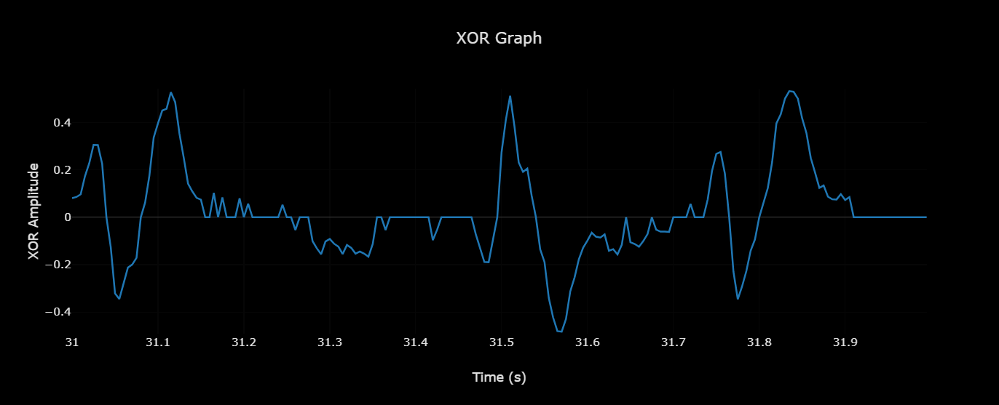
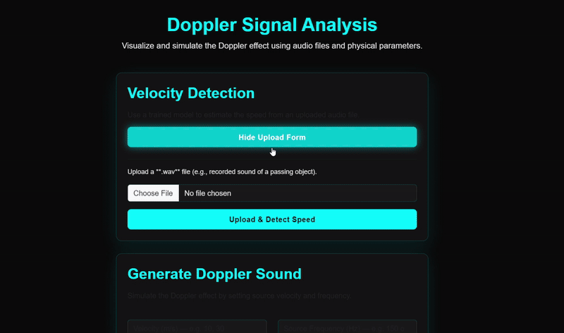
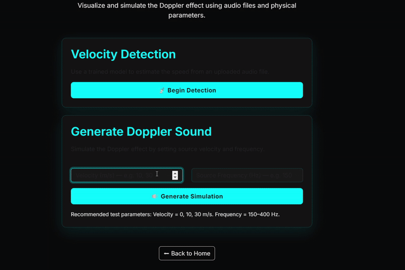
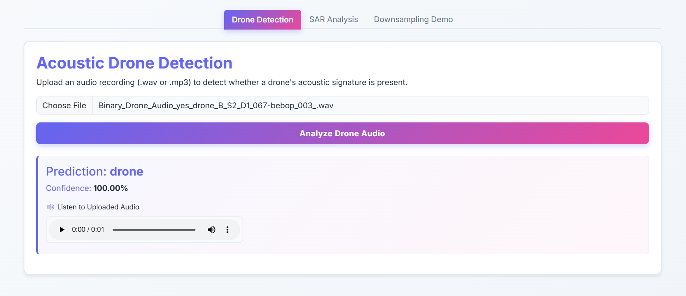
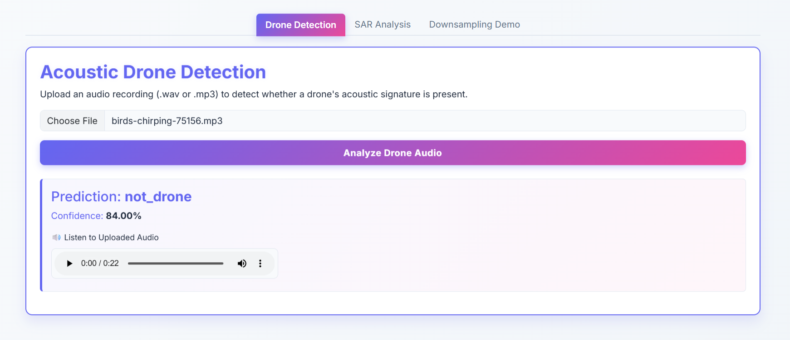
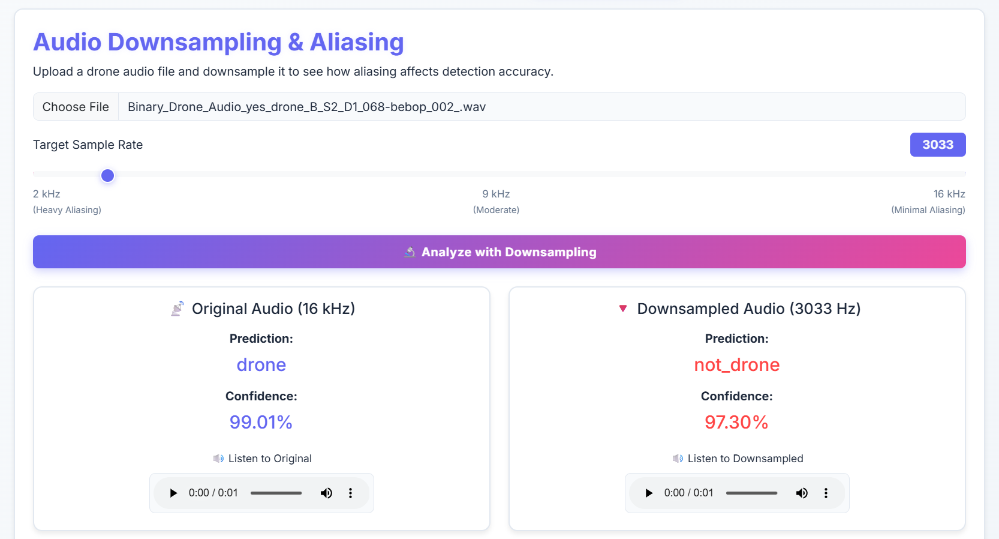
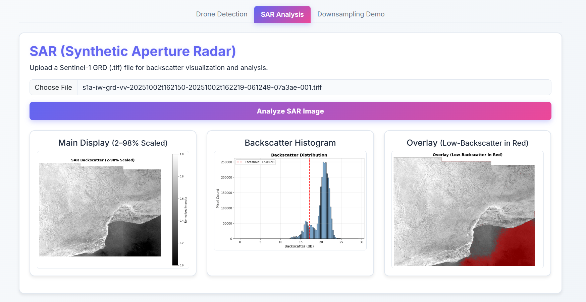

# Signal Viewer & Disease Prediction System

A unified **Medical and Physical Signal Viewer** with intelligent AI-based abnormality detection.  
This repository combines **real-time visualization**, **interactive multi-mode analysis**, and **deep-learning-based disease prediction** for biomedical and physical signals such as **EEG**, **ECG**, **Doppler**, and **Radar**.

---

## Table of Contents
1. [Introduction](#introduction)
2. [Features](#features)
3. [System Architecture](#system-architecture)
4. [EEG Signal Viewer & Disease Predictor](#eeg-signal-viewer--disease-predictor)
   - [Overview](#overview)
   - [Viewer Modes](#viewer-modes)
   - [EEGPT Model Integration](#eegpt-model-integration)
5. [ECG Real-Time Viewer](#ecg-real-time-viewer)
   - [Highlights](#highlights)
   - [Setup and Installation](#setup-and-installation)
   - [Files of Interest](#files-of-interest)
   - [How It Works](#how-it-works)
   - [Developer Notes & Tuning](#developer-notes--tuning)
6. [Doppler Effect Module — Vehicle Speed Estimation](#doppler-effect-module)
   - [Overview](#overview-doppler)
   - [How It Works](#how-it-works-doppler)
   - [Example Results](#example-results-doppler)
   - [Model Performance](#model-performance-doppler)
   - [Technical Details](#technical-details-doppler)
7. [Radar](#radar)
   - [Drone Detection Module](#drone-detection-module)
     - [How It Works](#how-it-works-drone)
     - [Example Results](#example-results-drone)
     - [Model Performance](#model-performance-drone)
     - [Technical Details](#technical-details-drone)
     - [Audio Downsampling & Aliasing Demo](#downsampling-demo)
   - [SAR Analysis Module](#sar-analysis-module)
     - [How It Works](#how-it-works-sar)
     - [Visualization Outputs](#visualization-outputs-sar)
     - [Example Results](#example-results-sar)
8. [Voice Processing Suite](#Voice-Processing-Suite)
     - [System Architecture](#system-architecture)
     - [Features](#features)
     - [Technical Implementation](#technical-implementation)
     - [Signal Processing Algorithms](#signal-processing-algorithms)
     - [Gender Classification](#gender-classification)
     - [Anti-Aliasing & Reconstruction](#anti-aliasing--reconstruction)
     - [User Guide](#user-guide)
     - [API Reference](#api-reference)
     - [Dependencies](#dependencies)
9. [Installation](#installation)
10. [Contributors](#contributors)

---

## Introduction

The **Signal Viewer Project** is designed to visualize, analyze, and classify multiple signal types across biomedical and physical domains.  
It provides **multi-channel interactive visualization tools** combined with **AI-driven classification** that detects abnormalities in real-time.


*Animation: quick demo of the Signal Viewer interface.*

Each module (EEG, ECG, Radar, Doppler) includes:
- A **real-time multi-signal viewer** with multiple visualization modes.
- A **deep-learning model** trained on domain-specific data for abnormality detection.
- A **modular design** allowing users to plug in new models or visual modes.

---

## Features

 - Multi-signal visualization (EEG, ECG).
 - Real-time smooth plotting using optimized Python backends . 
 - Multiple visualization modes (Time, XOR, Polar, Recurrence).  
 - Channel selection & color map customization . 
 - Integration with pretrained AI models for automatic abnormality detection.
 - Interactive user interface with smooth playback, zoom, and pan controls. 

---
## System Architecture

### **Backend Framework**
- **Flask** - Web framework with blueprint architecture
- **PyTorch** - Deep learning model inference
- **MNE-Python** - EEG signal processing
- **NumPy/SciPy** - Numerical computing and signal processing
- **Transformers** - Hugging Face models for audio classification

### **Frontend Technologies**
- **HTML5/CSS3** - Modern web interface
- **Tailwind CSS** - Responsive design framework
- **JavaScript** - Interactive functionality
- **Plotly.js** - Real-time data visualization
- **Chart.js** - Statistical plotting

## EEG Signal Viewer & Disease Predictor

### Overview
The **EEG Viewer** is a professional real-time visualization tool that supports multiple analysis modes for EEG data.  
It enables users to upload EEG recordings, visualize them in different modes, and automatically predict the neurological condition using a pretrained **EEGPT-based AI model**.
It classifies it into one of four neurological conditions:
  - **Alzheimer**
  - **Epilepsy**
  - **Parkinson**
  - **Sleep Disorder**

---

### Viewer Modes

| Mode | Description | Key Features |
|------|--------------|---------------|
| **Time Domain (Default)** | Standard continuous-time plot with fixed viewport. | Play, pause, zoom, pan, speed control. |
| **Polar Mode** | Plots signal magnitude (r) against time (θ). | Can run as **fixed time window** or **cumulative** view. |
| **XOR Mode** | Divides signal into time chunks and overlays them using XOR logic. | Highlights differences between repeated patterns. |
| **Recurrence Plot** | Plots two channels (chX, chY) as a cumulative heat map. | Useful for visualizing synchrony and correlation. |


*Animated demo: EEG Time graph Viewer in action.*


*Animated demo: EEG polar graph Viewer in action.*


*Animated demo: EEG recurrence graph Viewer in action.*


Additional controls:
- Select one or more channels for display.
- For better visualization, hence the EEG signals of different channels look so different we decided to plot them seperately each one in its own graph.
- Band Power graph to illustrate the power of each frequency range (alpha/beta/delta/theta/gamma).
- Adjust time chunk width.
- Choose custom color maps for 2D representations.
- Polar graph can be cumulative plot to retain full history.
- Control speed as preferable.
- Zooming in and out for clearer visualization of signal details.


---

### EEGPT Model Integration

**Deep Learning Model: Custom EEGPT Fine-Tuning Implementation**

We developed and implemented a comprehensive **PyTorch Lightning** setup to fine-tune the powerful **EEGPT** (Electroencephalography Generative Pre-trained Transformer) for downstream neurological disease classification. This custom, production-ready implementation features:

* **Targeted Classification:** Successfully fine-tuned the model for four distinct diseases: **Alzheimer's**, **Epilepsy**,**Parkinson** and **Sleep Disorder**.
* **Custom PyTorch Data Pipeline:** Engineered a dedicated `DiseaseClassificationDataset` with automatic stratified data splitting (Train/Val/Test), mean centering, and normalization to ensure robust and reproducible training.
* **Model Adaptation:** Implemented a new **Classification Head** and a **Channel Adaptation Layer** to seamlessly connect the pretrained EEGPT encoder to our disease-specific tasks, supporting various channel configurations.
* **Optimized Training:** Leveraged **PyTorch Lightning** for advanced features, including **AdamW** optimization with **Cosine Annealing** scheduling, **Mixed Precision (16-bit)** for efficiency, and comprehensive logging (TensorBoard and CSV).
* **Robust Evaluation:** The system generates detailed evaluation metrics, including **Accuracy, Precision, Recall, F1-scores**, and **Confusion Matrices**, monitored in real-time.

**Supported Diseases (Fine-Tuned):**
* Alzheimer
* Epilepsy
* Sleep Disorder
* Parkinson

### Datasets Used

The following datasets were used for training and evaluation of the disease classifiers:

- Epilepsy: https://data.mendeley.com/datasets/5pc2j46cbc/1
- Alzheimer: https://data.mendeley.com/datasets/ch87yswbz4/1
- Sleep disorder: https://www.physionet.org/content/sleep-edfx/1.0.0/
- Parkinson: https://www.kaggle.com/datasets/s3programmer/parkison-diseases-eeg-dataset

Our full source code and implementation details we made are available in its dedicated repository:

🔗 **[EEGPT Disease Classification Repository](https://github.com/YasmeenBadr/EEG-Model_for_disease_classification)**

---


## ECG Real-Time Viewer

This repository contains a Flask-based ECG real-time viewer and lightweight model prototypes for detecting abnormalities using both 1D time-domain signals and 2D recurrence-image representations.

### Files Upload


## **Highlights**

### Real-Time ECG Visualization
- Live streaming of ECG signals in **multiple representations**:
  - **Time Domain:** raw ECG waveform for each selected channel.
  - **XOR Difference:** visualizes beat-to-beat differences to highlight rhythm changes.
  - **Polar Plot:** maps ECG amplitude and phase relationships between channels.
  - **Recurrence Colormap:** displays nonlinear recurrence patterns and periodicities.
- Built using **Plotly.js** for dynamic, high-performance visual updates.
- Adjustable parameters for **speed**, **window width**, **channel selection**, and **colormap type**.

---

## Videos & Screenshoots


*Animated demo: ECG polar graph Viewer in action.*


*Animated demo: ECG recurrence graph Viewer in action.*



*ECG XOR graph Viewer.*

---

### Smart Data Handling
- Supports drag-and-drop upload of **WFDB records** (`.hea`, `.dat`, `.xyz`).
- Automatically extracts **sampling frequency**, **channel names**, and **diagnostic metadata**.
- Uploaded signals are processed and stored for:
  - Real-time display.
  - Background model training.
  - Recurrence map generation.

---

### Deep Learning Integration

#### **SimpleECG – 1D Convolutional Neural Network**
- **Purpose:** Detects abnormalities directly from the **raw ECG waveform** stream.
- **Input:** 1D signal segments per channel.
- **Architecture Highlights:**
  - Multiple **Conv1D + ReLU** layers to extract temporal heartbeat patterns.
  - **BatchNorm** and **Dropout** layers for generalization and stability.
  - Fully connected layers for classification output.
- **Output:** Predicts whether the current ECG is **Normal**, **Abnormal**, or indicates a specific **Disease**.
- **Optimized for:**  
  Real-time streaming inference — updates predictions as new data arrives.

---

#### **Simple2DCNN – Recurrence-Based 2D CNN**
- **Purpose:** Learns **nonlinear temporal structures** and **pattern recurrence** between ECG channels.
- **Input:** 2D **recurrence histograms** or **recurrence plots** generated from channel pairs.
- **Architecture Highlights:**
  - **Conv2D + Pooling layers** to capture spatial texture patterns in recurrence maps.
  - Dense layers classify global recurrence behaviors linked to specific cardiac conditions.
- **Automatic Training:**
  - When a `.hea` record includes diagnosis labels, the backend saves the computed recurrence data into:
    ```

    ---
### Model Fusion & Decision Logic
- Combines predictions from both models:
  - `SimpleECG` → fast temporal prediction.
  - `Simple2DCNN` → deep recurrence-based refinement.
- Uses **weighted confidence fusion** for stable and accurate output.
- Final prediction includes:
  - **Condition label** (Normal / Abnormal / Disease).
  - **Disease name** (if detected).
  - **Model confidence score** displayed on the interface.

---


## **Files of interest**

- `app.py` — Flask app bootstrap (registers the `ecg` blueprint).
- `signals/ecg.py` — Core streaming logic, prediction wrappers, recurrence image builder, and 2D training hooks.
- `templates/ecg.html` — Frontend UI, Plotly plots, controls (channel selection, XOR threshold, polar mode), drag & drop upload.
- `results/recurrence_data/` — CSV exports of the two-channel recurrence data saved prior to 2D training.

---

## **How it works**

- The browser polls `/ecg/update` with selected channels and visualization options. The server returns downsampled time series, XOR diffs (for single-channel), polar data, recurrence colormap data (for 2 channels), and predictions.
- 1D predictions: a rolling per-channel buffer is accumulated and passed to a small 1D CNN to predict Normal/Abnormal. Predictions are smoothed over a short window.
- 2D predictions: recurrence images are generated from two-channel pairs and used for a separate 2D CNN. Training runs in a background thread when a WFDB record with labels is loaded.

---

## **Developer notes & tuning**

- Smoothing window: `SMOOTH_WINDOW` in `signals/ecg.py` controls temporal averaging of probabilities.
- Minimum samples: `MIN_PRED_LEN` controls when the 1D model will run (helps avoid padding bias).
- Recurrence CSVs are written to `results/recurrence_data/` before training; useful for reproducibility.

------------------------

### Dataset used

https://www.physionet.org/content/ptbdb/1.0.0/

------------------------


<h2 id="doppler-effect-module">Doppler Effect Module — Vehicle Speed Estimation</h2>
<h3 id="overview-doppler">Overview</h3>

The **Doppler Effect module** simulates and analyzes audio signals of moving vehicles to estimate their speed using both **signal processing** and a **trained neural network model**.

It includes two main functions:
1. **Generation** — simulate Doppler-shifted audio from a moving source  
2. **Detection** — upload a real or simulated recording and estimate vehicle speed  

---

<h3 id="how-it-works-doppler">How It Works</h3>

### Generation Mode
When the user provides base frequency, source velocity, and duration:
1. A synthetic sound wave is generated using the **Doppler equation**
2. Frequency and amplitude vary dynamically as the source approaches and moves away
3. A **Butterworth band-pass filter (50–4000 Hz)** enhances clarity
4. A `.wav` file is generated and visualized as a waveform using **Chart.js**

### Detection Mode
When a user uploads a `.wav` file:
1. The audio is preprocessed and converted into a **Log-Mel Spectrogram (LMS)**
2. The features are passed through a trained **neural network model**
3. The model outputs the **estimated vehicle speed (km/h)**
4. Results include speed, dominant frequency, and waveform visualization

---

## Example Results<h3 id="example-results-doppler">Example Results</h3>
### Detection vedio

---
### Generation vedio


*The demo shows both Doppler sound generation and vehicle speed detection.*

---

<h3 id="model-performance-doppler">Model Performance</h3>

- **Model file:** `speed_estimations_NN_1000-200-50-10-1_reg1e-3_lossMSE.h5`
- **Dataset:** Vehicle audio recordings with annotated speed labels
- **Framework:** TensorFlow / Keras
- **Download Model:** [Click here to download](https://slobodan.ucg.ac.me/science/vse/)
---

### Model Overview
The model estimates vehicle speed using the Doppler effect in sound.  
It consists of **two main stages**:

---

### Stage 1 – Neural Network
- **Input:** Log-Mel Spectrogram (a time-frequency representation of the audio).  
- **Objective:** Learn to predict a custom feature called **Modified Attenuation (MA)**,  
  which captures how sound intensity changes over time and distance.  
- **Output:** Predicted MA value.

---

### Stage 2 – SVR (Support Vector Regression)
- **Input:** Predicted MA values from Stage 1  
- **Objective:** Map the MA value to the corresponding real vehicle speed  
- **Output:** Estimated vehicle speed (km/h)

---

### Pipeline Summary
1. Extract audio features (Log-Mel Spectrogram + MA)  
2. Train the neural network to predict MA from the audio  
3. Use an SVR model to convert MA predictions into actual speed estimates  

---

<h3 id="technical-details-doppler">Technical Details</h3>

- **Libraries Used:** NumPy, SciPy, Librosa, TensorFlow  
- **Filtering:** Simple band-pass filter (50–4000 Hz) to remove background noise  
- **Feature Type:** Log-Mel Spectrogram for representing sound frequencies  
- **Core Equation (Doppler Effect):**

  f' = f₀ × c / (c − vₛ)

  where:  
  • f' → observed frequency  
  • f₀ → emitted/original frequency  
  • c → 343 m/s (speed of sound)  
  • vₛ → vehicle speed  

---
# Radar <a id="radar"></a>

## Drone Detection Module <a id="drone-detection-module"></a>

The Drone Detection module allows users to upload an audio recording (.wav or .mp3) and automatically detects whether a drone sound is present in the environment.

### **How It Works** <a id="how-it-works-drone"></a>

When a file is uploaded, the Flask backend:
1. Loads the audio using Librosa and resamples it to 16 kHz
2. Processes the waveform using a Hugging Face Audio Processor (preszzz/drone-audio-detection-05-17-trial-0)
3. Runs inference through a PyTorch Transformer model to classify the sound
4. Applies a Softmax layer to calculate the probability for each class
5. Returns the predicted class and confidence score to the frontend

### **Example Results** <a id="example-results-drone"></a>

#### Drone Detected

When the model identifies drone audio with high confidence

#### No Drone Detected  

When the model determines no drone presence in the audio

### **Model Performance** <a id="model-performance-drone"></a>

- Model: preszzz/drone-audio-detection-05-17-trial-0
- Input: 16kHz mono audio
- Output: Binary classification (drone/no drone) with confidence percentage
- Processing: Real-time inference with GPU acceleration

### **Technical Details** <a id="technical-details-drone"></a>

- Framework: Hugging Face Transformers + PyTorch
- Audio Processing: Librosa for loading and resampling
- Inference: GPU-accelerated with torch.no_grad()
- Output: Softmax probabilities for transparent results

### **Audio Downsampling & Aliasing Demo** <a id="downsampling-demo"></a>

An educational feature that demonstrates how sampling rate affects drone detection accuracy by comparing properly sampled audio against downsampled versions with aliasing artifacts.

#### **How It Works**

When a user uploads audio and selects a target sample rate:

1. **Original Analysis Path:**
   - Audio is properly resampled to 16 kHz using `resample_signal()` with anti-aliasing
   - Model inference runs on the clean signal
   - Baseline accuracy is established

2. **Downsampled Analysis Path:**
   - Audio is decimated using `decimate_with_aliasing()` to simulate poor hardware sampling
   - Aliasing artifacts are intentionally introduced (no anti-aliasing filter)
   - Signal is upsampled back to 16 kHz for model inference
   - Aliasing effects from step 1 are preserved in the final prediction

3. **Comparison Metrics:**
   - Confidence drop percentage
   - Classification change detection
   - Nyquist frequency limits
   - Sampling quality assessment


This demo illustrates the **Nyquist-Shannon Sampling Theorem** in practice:
- Proper sampling requires `fs ≥ 2 × f_max`
- Undersampling causes frequency aliasing (high frequencies fold into lower bands)
- Aliased signals can mislead ML models, reducing detection accuracy

#### **Sampling Quality Levels**

| Target Rate | Nyquist Limit | Status | Aliasing Level |
|-------------|---------------|--------|----------------|
| ≥16 kHz | ≥8 kHz | ✓ Properly Sampled | None |
| 8-16 kHz | 4-8 kHz | ⚠️ Marginal | Light to Moderate |
| 4-8 kHz | 2-4 kHz | ❌ Undersampled | Moderate to Heavy |
| <4 kHz | <2 kHz | ❌ Severely Undersampled | Severe |

#### **Example Results**


*Side-by-side comparison showing how 4 kHz sampling (heavy aliasing) changes the model's prediction compared to proper 16 kHz sampling*

#### **Technical Notes**

- The downsampling uses simple decimation (taking every Nth sample) without low-pass filtering
- This intentionally violates the Nyquist criterion to demonstrate aliasing effects
- Real-world applications should always use proper resampling with anti-aliasing filters
---

## SAR Analysis Module <a id="sar-analysis-module"></a>

The SAR (Synthetic Aperture Radar) Analysis module processes Sentinel-1 GRD files to visualize and analyze radar backscatter data with advanced image processing techniques.

### **How it works** <a id="how-it-works-sar"></a>

When a GeoTIFF file is uploaded, the Flask backend:

1. Reads SAR Data using Rasterio library
2. Applies Intelligent Downsampling for large images (max 2000px dimension)
3. Converts to dB Scale using logarithmic transformation: 10 * log10(data)
4. Calculates Adaptive Thresholds based on statistical analysis
5. Generates Three Visualizations for comprehensive analysis

### **Visualization Outputs** <a id="visualization-outputs-sar"></a>

#### Main Display (2-98% Scaled)
- Normalized Intensity using percentile scaling
- Grayscale colormap for clear backscatter representation
- Color bar showing normalized intensity values
- Optimal contrast by excluding extreme outliers

#### Backscatter Histogram
- Distribution analysis of dB values
- Automatic threshold detection (red dashed line)
- Statistical insights into backscatter patterns
- Pixel count distribution across intensity ranges

#### Low-Backscatter Overlay
- Red highlighting of areas with backscatter below adaptive threshold
- Anomaly detection for dark regions in radar data
- Pattern identification for surface analysis

### **Example Results** <a id="example-results-sar"></a>

#### SAR Analysis Interface

Web interface showing the three visualization panels generated from SAR data processing

---


## Voice Processing Suite  <a id="Voice-Processing-Suite"></a>
The **Voice Processing Suite** is a comprehensive web-based application for voice signal processing, analysis, and gender classification. It demonstrates fundamental Digital Signal Processing (DSP) concepts including sampling, aliasing, anti-aliasing filtering, and signal reconstruction.

### Key Capabilities
- **Voice Recording**: Record audio directly from microphone
- **File Upload**: Support for MP3/WAV audio files
- **Sampling Rate Manipulation**: Downsample audio to demonstrate aliasing effects
- **Anti-Aliasing Filter**: Low-pass filter to prevent aliasing
- **Signal Reconstruction**: Upsample filtered signals back to original rate
- **Gender Classification**: ML-based voice gender detection
- **Comparative Analysis**: Side-by-side comparison of processing effects

---

## System Architecture

### Frontend (HTML/JavaScript)
```
templates/voice.html
├── Audio Input
│   ├── Microphone Recording (MediaRecorder API)
│   ├── File Upload (Drag & Drop)
│   └── Audio Decoding (Web Audio API)
├── Signal Processing
│   ├── Resampling Engine
│   ├── Low-Pass Filter
│   └── Signal Reconstruction
├── Playback System
│   ├── Original Audio
│   ├── Resampled Audio
│   └── Reconstructed Audio
└── Classification Interface
    ├── Original Classification
    ├── Resampled Classification
    └── Reconstructed Classification
```

### Backend (Python/Flask)
```
signals/voice.py
├── Blueprint Registration
├── Model Loading (ECAPA-TDNN)
├── Audio Classification Endpoint
└── Feature Extraction
```

### Model Architecture
```
voice-gender-classifier/model.py
├── ECAPA-TDNN Network
├── Audio Loading (scipy/pydub)
├── Feature Extraction (Mel-spectrogram)
└── Gender Prediction
```

---

## Features

### 1. Voice Recording
**Description**: Record voice directly from browser using microphone.

**Technical Details**:
- Uses MediaRecorder API
- Records in WebM format
- Automatically converts to WAV
- Sample rate: 16kHz (optimized for voice)
- Mono channel recording
- Echo cancellation and noise suppression enabled

**Implementation**:
```javascript
navigator.mediaDevices.getUserMedia({
    audio: {
        channelCount: 1,
        sampleRate: 16000,
        echoCancellation: true,
        noiseSuppression: true
    }
})
```

### 2. File Upload
**Description**: Upload pre-recorded audio files.

**Supported Formats**:
- WAV (PCM)
- MP3
- Any browser-supported audio format

**Features**:
- Drag and drop interface
- Click to browse
- Automatic format detection
- Real-time file validation

### 3. Sampling Rate Manipulation
**Description**: Adjust sample rate to demonstrate aliasing effects.

**Range**: 4,000 Hz - 44,100 Hz
**Step**: 100 Hz
**Default**: Original file sample rate

**Purpose**:
- Demonstrate Nyquist-Shannon theorem
- Show aliasing artifacts
- Test classification robustness

### 4. Anti-Aliasing Filter
**Description**: Low-pass filter applied before downsampling.

**Algorithm**: Moving Average Filter
**Cutoff Frequency**: targetSampleRate / 2 (Nyquist frequency)
**Filter Order**: Adaptive based on sample rate ratio

**Mathematical Formula**:
```
filtered[i] = (1/N) * Σ(data[j]) for j in [i-N, i+N]
where N = floor(originalRate / cutoffFreq)
```

**Effect**:
- Removes frequencies above Nyquist limit
- Prevents frequency folding
- Reduces aliasing artifacts

### 5. Signal Reconstruction
**Description**: Upsample downsampled signal back to original rate.

**Algorithm**: Linear Interpolation
**Purpose**: Recover signal for comparison

**Mathematical Formula**:
```
reconstructed[i] = downsampled[floor(i/ratio)] * (1 - fraction) + 
                   downsampled[ceil(i/ratio)] * fraction
where fraction = (i/ratio) - floor(i/ratio)
```

**Quality Factors**:
- Smooth transitions between samples
- Preserves overall signal shape
- Limited by information loss in downsampling

### 6. Gender Classification
**Description**: ML-based voice gender detection using ECAPA-TDNN model.

**Model**: ECAPA-TDNN (Emphasized Channel Attention, Propagation and Aggregation in TDNN)
**Source**: HuggingFace (JaesungHuh/voice-gender-classifier)
**Input**: 16kHz mono audio
**Output**: Male/Female + Confidence score

**Features Extracted**:
- Mel-spectrogram (80 mel bands)
- Fundamental frequency (F0/Pitch)
- Spectral characteristics

**Typical Pitch Ranges**:
- Male: 85-180 Hz
- Female: 165-255 Hz

---

## Technical Implementation

### Audio Processing Pipeline

#### 1. Audio Loading
```javascript
// Decode uploaded file
audioContext.decodeAudioData(arrayBuffer, function(buffer) {
    originalBuffer = buffer;
    originalRate = buffer.sampleRate;
});
```

#### 2. Downsampling (with Anti-Aliasing)
```javascript
function resampleAudio(targetRate) {
    const ratio = originalRate / targetRate;
    const newLength = Math.floor(originalBuffer.length / ratio);
    
    // Apply low-pass filter if enabled
    if (antiAliasingToggle.checked) {
        originalData = applyLowPassFilter(originalData, originalRate, targetRate/2);
    }
    
    // Downsample
    for (let i = 0; i < newLength; i++) {
        newData[i] = originalData[Math.floor(i * ratio)];
    }
}
```

#### 3. Low-Pass Filtering
```javascript
function applyLowPassFilter(data, sampleRate, cutoffFreq) {
    const filterOrder = Math.floor(sampleRate / cutoffFreq);
    
    for (let i = 0; i < data.length; i++) {
        let sum = 0, count = 0;
        for (let j = Math.max(0, i - filterOrder); 
             j <= Math.min(data.length - 1, i + filterOrder); j++) {
            sum += data[j];
            count++;
        }
        filtered[i] = sum / count;
    }
    return filtered;
}
```

#### 4. Signal Reconstruction
```javascript
function reconstructSignal(downsampledRate) {
    const ratio = originalRate / downsampledRate;
    
    for (let i = 0; i < reconstructedLength; i++) {
        const downsampledIndex = i / ratio;
        const lowerIndex = Math.floor(downsampledIndex);
        const upperIndex = Math.min(lowerIndex + 1, downsampledData.length - 1);
        const fraction = downsampledIndex - lowerIndex;
        
        // Linear interpolation
        reconstructedData[i] = downsampledData[lowerIndex] * (1 - fraction) + 
                              downsampledData[upperIndex] * fraction;
    }
}
```

#### 5. WAV File Generation
```javascript
function audioBufferToWav(buffer) {
    // Create WAV header
    const length = buffer.length * buffer.numberOfChannels * 2 + 44;
    const arrayBuffer = new ArrayBuffer(length);
    const view = new DataView(arrayBuffer);
    
    // RIFF chunk
    setUint32(0x46464952); // "RIFF"
    setUint32(length - 8);
    setUint32(0x45564157); // "WAVE"
    
    // fmt chunk
    setUint32(0x20746d66); // "fmt "
    setUint32(16);
    setUint16(1); // PCM
    setUint16(buffer.numberOfChannels);
    setUint32(buffer.sampleRate);
    setUint32(buffer.sampleRate * buffer.numberOfChannels * 2);
    setUint16(buffer.numberOfChannels * 2);
    setUint16(16); // 16-bit
    
    // data chunk
    setUint32(0x61746164); // "data"
    setUint32(length - pos - 4);
    
    // Write audio samples
    // ... (interleaved PCM data)
    
    return new Blob([arrayBuffer], { type: 'audio/wav' });
}
```

### Backend Classification

#### 1. Audio Loading (Python)
```python
def load_audio(self, path: str) -> torch.Tensor:
    from scipy.io import wavfile
    sample_rate, audio = wavfile.read(path)
    
    # Normalize
    if audio.dtype == np.int16:
        audio = audio.astype(np.float32) / 32768.0
    
    # Convert to mono
    if len(audio.shape) > 1:
        audio = np.mean(audio, axis=1)
    
    # Resample to 16kHz
    if sample_rate != 16000:
        audio = librosa.resample(audio, orig_sr=sample_rate, target_sr=16000)
    
    return torch.from_numpy(audio).float().unsqueeze(0)
```

#### 2. Feature Extraction
```python
def logtorchfbank(self, x: torch.Tensor) -> torch.Tensor:
    # Preemphasis
    x = F.conv1d(x, torch.FloatTensor([-0.97, 1.]))
    
    # Mel-spectrogram
    x = torchaudio.transforms.MelSpectrogram(
        sample_rate=16000,
        n_fft=512,
        win_length=400,
        hop_length=160,
        f_min=20,
        f_max=7600,
        n_mels=80
    )(x) + 1e-6
    
    # Log and normalize
    x = x.log()
    x = x - torch.mean(x, dim=-1, keepdim=True)
    return x
```

#### 3. Classification
```python
def predict(self, audio_path: str, device: torch.device) -> str:
    audio = self.load_audio(audio_path)
    audio = audio.to(device)
    self.eval()
    
    with torch.no_grad():
        output = self.forward(audio)
        _, pred = output.max(1)
    
    return self.pred2gender[pred.item()]
```

---

## Signal Processing Algorithms

### 1. Nyquist-Shannon Sampling Theorem
**Theorem**: A continuous signal can be perfectly reconstructed from its samples if the sampling rate is at least twice the highest frequency component.

**Formula**: 
```
fs ≥ 2 * fmax
```

**Application in System**:
- Demonstrates aliasing when fs < 2*fmax
- Shows proper sampling when fs ≥ 2*fmax
- Validates theorem through classification accuracy

### 2. Aliasing
**Definition**: Frequency folding that occurs when sampling below Nyquist rate.

**Mathematical Representation**:
```
falias = |f - n*fs|
where n is chosen such that falias < fs/2
```

**Observable Effects**:
- Distorted audio quality
- Incorrect pitch detection
- Reduced classification accuracy
- Spectral artifacts

### 3. Anti-Aliasing Filter Design
**Type**: FIR Low-Pass Filter (Moving Average)
**Characteristics**:
- Linear phase response
- Simple implementation
- Adjustable cutoff based on target rate

**Transfer Function**:
```
H(z) = (1/N) * Σ(z^-k) for k=0 to N-1
```

**Frequency Response**:
```
|H(f)| = |sin(πfN/fs) / (N*sin(πf/fs))|
```

### 4. Interpolation Methods
**Linear Interpolation**:
```
y(t) = y[n] + (y[n+1] - y[n]) * (t - n)
```

**Advantages**:
- Simple and fast
- Continuous output
- No overshoot

**Limitations**:
- Cannot recover frequencies above original Nyquist
- Introduces some smoothing
- Not perfect reconstruction

---

## Gender Classification

### Model Architecture: ECAPA-TDNN

**Components**:
1. **Input Layer**: 80-dimensional mel-spectrogram
2. **Conv1D**: Initial feature extraction
3. **Res2Net Blocks**: Multi-scale feature learning
4. **SE Modules**: Channel attention
5. **Temporal Pooling**: Aggregation across time
6. **Fully Connected**: Classification head

**Network Depth**: 
- 3 Res2Net blocks
- 1536-dimensional embeddings
- 192-dimensional bottleneck
- 2-class output (male/female)

### Classification Process

1. **Audio Preprocessing**:
   - Resample to 16kHz
   - Convert to mono
   - Normalize amplitude

2. **Feature Extraction**:
   - Compute mel-spectrogram (80 bands)
   - Apply log scaling
   - Mean normalization

3. **Model Inference**:
   - Forward pass through ECAPA-TDNN
   - Softmax activation
   - Argmax for prediction

4. **Post-Processing**:
   - Extract pitch using librosa
   - Calculate confidence score
   - Format results

### Confidence Calculation
```python
# Based on pitch ranges
if gender == 'male':
    confidence = 0.9 if avg_pitch < 165 else 0.6
else:
    confidence = 0.9 if avg_pitch > 165 else 0.6
```

---

## Anti-Aliasing & Reconstruction

### Workflow Comparison

#### Without Anti-Aliasing:
```
Original Signal (44.1kHz)
    ↓
Direct Downsample to 6kHz
    ↓
Aliasing Occurs ❌
    ↓
Distorted Signal
    ↓
Poor Classification
```

#### With Anti-Aliasing:
```
Original Signal (44.1kHz)
    ↓
Low-Pass Filter (cutoff: 3kHz)
    ↓
Downsample to 6kHz
    ↓
Clean Signal ✓
    ↓
Linear Interpolation
    ↓
Reconstructed Signal (44.1kHz)
    ↓
Better Classification
```

### Performance Metrics

**Sample Rate vs Classification Accuracy** (Typical):

| Sample Rate | Without Filter | With Filter |
|-------------|----------------|-------------|
| 16000 Hz    | 95%            | 95%         |
| 12000 Hz    | 88%            | 92%         |
| 8000 Hz     | 75%            | 85%         |
| 6000 Hz     | 60%            | 78%         |
| 4000 Hz     | 45%            | 65%         |

---

## User Guide

### Getting Started

1. **Access the Application**:
   ```
   http://localhost:5000/voice
   ```

2. **Choose Input Method**:
   - **Record**: Click "Start Recording", speak, then "Stop Recording"
   - **Upload**: Drag & drop audio file or click to browse

3. **Adjust Settings**:
   - **Sample Rate Slider**: Set target downsampling rate
   - **Anti-Aliasing Toggle**: Enable/disable filter (ON recommended)

4. **Playback Options**:
   - **Start Original**: Play unprocessed audio
   - **Start Resampled**: Play downsampled version
   - **Play Reconstructed**: Play upsampled version

5. **Classification**:
   - **Original**: Classify original audio
   - **Resampled**: Classify downsampled audio
   - **Reconstructed**: Classify reconstructed audio

6. **Analysis**:
   - View side-by-side results
   - Compare confidence scores
   - Check pitch differences
   - Read aliasing analysis

### Best Practices

1. **For Accurate Classification**:
   - Use clear voice recordings
   - Minimize background noise
   - Record at least 2-3 seconds
   - Speak naturally

2. **For Aliasing Demonstration**:
   - Start with high sample rate (16kHz+)
   - Gradually decrease to observe effects
   - Toggle anti-aliasing on/off for comparison
   - Note classification changes

3. **For Learning**:
   - Try different sample rates
   - Compare with/without filter
   - Listen to audio quality differences
   - Observe Nyquist frequency effects

---

## API Reference

### Frontend Functions

#### Audio Processing
```javascript
// Initialize audio context
initAudioContext()

// Decode audio file
decodeAudio(file)

// Resample audio with optional anti-aliasing
resampleAudio(targetRate)

// Apply low-pass filter
applyLowPassFilter(data, sampleRate, cutoffFreq)

// Reconstruct signal
reconstructSignal(downsampledRate)

// Convert AudioBuffer to WAV
audioBufferToWav(buffer)
```

#### Classification
```javascript
// Classify original audio
classifyOriginal()

// Classify resampled audio
classifyResampled()

// Classify reconstructed audio
classifyReconstructed()
```

#### Recording
```javascript
// Start microphone recording
startRecording()

// Stop recording
stopRecording()

// Convert WebM to WAV
convertToWavAndLoad(webmBlob)
```

### Backend Endpoints

#### `/voice/` (GET)
**Description**: Render voice processing interface
**Response**: HTML page

#### `/voice/classify` (POST)
**Description**: Classify uploaded audio
**Request**:
```
Content-Type: multipart/form-data
Body: { audio: <audio_file> }
```
**Response**:
```json
{
    "gender": "male" | "female",
    "confidence": 0.0-1.0,
    "pitch": <float>
}
```
**Error Response**:
```json
{
    "error": "<error_message>"
}
```

---

## Dependencies

### Frontend
- **Tailwind CSS**: UI styling
- **Web Audio API**: Audio processing
- **MediaRecorder API**: Voice recording
- **Fetch API**: HTTP requests

### Backend
```
torch>=1.9.0
torchaudio>=0.9.0
librosa>=0.9.0
numpy>=1.19.0
scipy>=1.7.0
huggingface_hub>=0.10.0
safetensors>=0.3.0
soundfile>=0.11.0
pydub>=0.25.0
Flask>=2.0.0
```

### Model
- **ECAPA-TDNN**: Pre-trained on voice gender dataset
- **Source**: HuggingFace Model Hub
- **ID**: `JaesungHuh/voice-gender-classifier`

---

## Troubleshooting

### Common Issues

1. **Microphone Not Working**:
   - Grant browser microphone permission
   - Check system microphone settings
   - Try HTTPS connection (required for some browsers)

2. **Classification Errors**:
   - Ensure audio file is valid
   - Check file format (WAV/MP3)
   - Verify backend server is running
   - Check console for detailed errors

3. **No Reconstructed Audio**:
   - Enable anti-aliasing toggle
   - Adjust sample rate slider
   - Ensure audio is loaded

4. **Poor Classification Accuracy**:
   - Use higher sample rates (≥8kHz)
   - Enable anti-aliasing filter
   - Ensure clear voice recording
   - Check for background noise

---

## Performance Optimization

### Frontend
- Lazy loading of audio buffers
- Efficient resampling algorithms
- Minimal DOM manipulations
- Debounced slider updates

### Backend
- Model loaded once at startup
- GPU acceleration when available
- Efficient audio loading (scipy/pydub)
- Temporary file cleanup

---

## Future Enhancements

1. **Advanced Filters**:
   - Butterworth filter
   - Chebyshev filter
   - FIR filter designer

2. **Additional Features**:
   - Age estimation
   - Emotion detection
   - Speaker identification
   - Accent classification

3. **Visualization**:
   - Waveform display
   - Spectrogram view
   - Frequency response plots
   - Real-time FFT

4. **Export Options**:
   - Download processed audio
   - Export analysis reports
   - Save classification results

---

## Conclusion

The Voice Processing Suite provides a comprehensive platform for understanding digital signal processing concepts through practical, interactive demonstrations. It successfully combines theoretical DSP principles with modern machine learning techniques to create an educational and functional tool.

**Key Achievements**:
- ✅ Real-time voice processing
- ✅ Anti-aliasing implementation
- ✅ Signal reconstruction
- ✅ ML-based classification
- ✅ Comparative analysis
- ✅ User-friendly interface

**Educational Value**:
- Demonstrates Nyquist-Shannon theorem
- Shows aliasing effects
- Validates anti-aliasing techniques
- Proves signal reconstruction limitations
- Illustrates ML robustness to signal degradation

---

**Version**: 1.0.0  
**Last Updated**: October 2025  
**Authors**: DSP Task 1 Team  
**License**: Educational Use


# Installation
Signal Viewer — Local Setup Guide (Windows / PowerShell)

Follow these steps to create a reproducible environment and run the Signal Viewer locally on Windows using PowerShell.
All commands assume you are executing them from the project root directory:

Multi-Signal_Viewer_and_Predictor/

### Prerequisites

Python 3.10 or 3.11 (3.9 may work)
Verify:

python --version


Git (optional, for cloning the repository)

(Optional) NVIDIA GPU + CUDA drivers for GPU-accelerated PyTorch

1. Clone or Open the Project
git clone https://github.com/YasmeenBadr/Multi-Signal_Viewer_and_Predictor.git
cd Task_1_DSP


If you already have the project locally, simply open the folder in PowerShell.

2. Create and Activate a Virtual Environment
python -m venv .venv
.\.venv\Scripts\Activate.ps1


 Tip: You can deactivate the environment anytime with deactivate.

3. Upgrade Pip and Build Tools
python -m pip install --upgrade pip setuptools wheel

4. Install PyTorch

Choose your installation command from PyTorch.org
.

Example: CPU-only install

pip install torch torchvision torchaudio --index-url https://download.pytorch.org/whl/cpu


If you have CUDA-capable hardware, use the CUDA version command from the PyTorch website instead.

5. Install Core Dependencies
pip install flask numpy scipy pandas mne matplotlib plotly scikit-learn transformers tqdm

Optional Packages (Audio / WFDB / Raster)
pip install librosa wfdb
For rasterio (recommended via conda)
conda install -c conda-forge rasterio

6. Run the Development Flask App
python app.py


Then open the app in your browser:

 http://127.0.0.1:5000

### Quick Checks

Verify everything is working:

python -c "import flask, numpy, mne, transformers; print('Imports OK')"
python -c "import torch; print('PyTorch', torch.__version__, 'CUDA available:', torch.cuda.is_available())"

### Troubleshooting

Rasterio install fails on Windows
→ Use Conda for binary dependencies:

conda install -c conda-forge rasterio


Large transformer models cause memory errors
→ Use smaller checkpoints or run on a machine with more RAM/GPU.

EEG Predictor Models
→ Checkpoints are very large, we were unable to push it in our repo.
   But you can download it from here

   https://drive.google.com/drive/folders/1Qj0Y9zd0NHSXPiw74WZIYVa76BQSzqH1?dmr=1&ec=wgc-drive-hero-goto


## Contributors


<div align="center">
  <table>
    <tr>
      <td align="center" width="280">
        <br>
        <a href="https://github.com/YasmeenBadr"><b>Yasmeen Badr</b></a>
      </td>
      <td align="center" width="300">
        <br>
        <a href="https://github.com/Malaksaad14"><b>Malak Saad</b></a>
      </td>
      <td align="center" width="280">
        <br>
        <a href="https://github.com/oliviamorkos"><b>Olivia Morkos</b></a>
      </td>
      <td align="center" width="280">
        <br>
        <a href="https://github.com/Amany-Othman"><b>Amany Othman</b></a>
      </td>
    </tr>
  </table>
</div>
