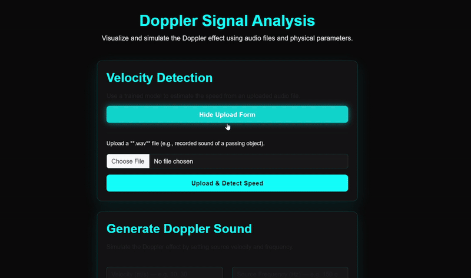

# Signal Viewer & Disease Prediction System

A unified **Medical and Physical Signal Viewer** with intelligent AI-based abnormality detection.  
This repository combines **real-time visualization**, **interactive multi-mode analysis**, and **deep-learning-based disease prediction** for biomedical and physical signals such as **EEG**, **ECG**, **Doppler**, and **Radar**.

---

## Table of Contents
1. [Introduction](#introduction)
2. [Features](#features)
3. [System Architecture](#system-architecture)
4. [EEG Signal Viewer & Disease Predictor](#eeg-signal-viewer--disease-predictor)
   - [Overview](#overview)
   - [Viewer Modes](#viewer-modes)
   - [EEGPT Model Integration](#eegpt-model-integration)
5. [ECG Real-Time Viewer](#ecg-real-time-viewer)
   - [Highlights](#highlights)
   - [Setup and Installation](#setup-and-installation)
   - [Files of Interest](#files-of-interest)
   - [How It Works](#how-it-works)
   - [Developer Notes & Tuning](#developer-notes--tuning)
   - [Application Interface](#application-interface)
6. [Doppler](#acoustic-signal-viewer-coming-soon)
7. [Radar](#rf-signal-viewer-coming-soon)
8. [Installation](#installation)
9. [Contributors](#contributors)
10. [License](#license)

---

## Introduction

The **Signal Viewer Project** is designed to visualize, analyze, and classify multiple signal types across biomedical and physical domains.  
It provides **multi-channel interactive visualization tools** combined with **AI-driven classification** that detects abnormalities in real-time.


*Animation: quick demo of the Signal Viewer interface.*

Each module (EEG, ECG, Radar, Doppler) includes:
- A **real-time multi-signal viewer** with multiple visualization modes.
- A **deep-learning model** trained on domain-specific data for abnormality detection.
- A **modular design** allowing users to plug in new models or visual modes.

---

## Features

 - Multi-signal visualization (EEG, ECG).
 - Real-time smooth plotting using optimized Python backends . 
 - Multiple visualization modes (Time, XOR, Polar, Recurrence).  
 - Channel selection & color map customization . 
 - Integration with pretrained AI models for automatic abnormality detection.
 - Interactive user interface with smooth playback, zoom, and pan controls. 

---
## System Architecture

### **Backend Framework**
- **Flask** - Web framework with blueprint architecture
- **PyTorch** - Deep learning model inference
- **MNE-Python** - EEG signal processing
- **NumPy/SciPy** - Numerical computing and signal processing
- **Transformers** - Hugging Face models for audio classification

### **Frontend Technologies**
- **HTML5/CSS3** - Modern web interface
- **Tailwind CSS** - Responsive design framework
- **JavaScript** - Interactive functionality
- **Plotly.js** - Real-time data visualization
- **Chart.js** - Statistical plotting

## EEG Signal Viewer & Disease Predictor

### Overview
The **EEG Viewer** is a professional real-time visualization tool that supports multiple analysis modes for EEG data.  
It enables users to upload EEG recordings, visualize them in different modes, and automatically predict the neurological condition using a pretrained **EEGPT-based AI model**.
It classifies it into one of four neurological conditions:
  - **Alzheimer**
  - **Epilepsy**
  - **Parkinson**
  - **Sleep Disorder**

---

### Viewer Modes

| Mode | Description | Key Features |
|------|--------------|---------------|
| **Time Domain (Default)** | Standard continuous-time plot with fixed viewport. | Play, pause, zoom, pan, speed control. |
| **Polar Mode** | Plots signal magnitude (r) against time (θ). | Can run as **fixed time window** or **cumulative** view. |
| **XOR Mode** | Divides signal into time chunks and overlays them using XOR logic. | Highlights differences between repeated patterns. |
| **Recurrence Plot** | Plots two channels (chX, chY) as a cumulative heat map. | Useful for visualizing synchrony and correlation. |


*Animated demo: EEG Time graph Viewer in action.*


*Animated demo: EEG polar graph Viewer in action.*


*Animated demo: EEG recurrence graph Viewer in action.*


Additional controls:
- Select one or more channels for display.
- For better visualization, hence the EEG signals of different channels look so different we decided to plot them seperately each one in its own graph.
- Band Power graph to illustrate the power of each frequency range (alpha/beta/delta/theta/gamma).
- Adjust time chunk width.
- Choose custom color maps for 2D representations.
- Polar graph can be cumulative plot to retain full history.
- Control speed as preferable.
- Zooming in and out for clearer visualization of signal details.


---

### EEGPT Model Integration

**Deep Learning Model: Custom EEGPT Fine-Tuning Implementation**

We developed and implemented a comprehensive **PyTorch Lightning** setup to fine-tune the powerful **EEGPT** (Electroencephalography Generative Pre-trained Transformer) for downstream neurological disease classification. This custom, production-ready implementation features:

* **Targeted Classification:** Successfully fine-tuned the model for four distinct diseases: **Alzheimer's**, **Epilepsy**,**Parkinson** and **Sleep Disorder**.
* **Custom PyTorch Data Pipeline:** Engineered a dedicated `DiseaseClassificationDataset` with automatic stratified data splitting (Train/Val/Test), mean centering, and normalization to ensure robust and reproducible training.
* **Model Adaptation:** Implemented a new **Classification Head** and a **Channel Adaptation Layer** to seamlessly connect the pretrained EEGPT encoder to our disease-specific tasks, supporting various channel configurations.
* **Optimized Training:** Leveraged **PyTorch Lightning** for advanced features, including **AdamW** optimization with **Cosine Annealing** scheduling, **Mixed Precision (16-bit)** for efficiency, and comprehensive logging (TensorBoard and CSV).
* **Robust Evaluation:** The system generates detailed evaluation metrics, including **Accuracy, Precision, Recall, F1-scores**, and **Confusion Matrices**, monitored in real-time.

**Supported Diseases (Fine-Tuned):**
* Alzheimer
* Epilepsy
* Sleep Disorder
* Parkinson

### Datasets Used

The following datasets were used for training and evaluation of the disease classifiers:

- Epilepsy: https://data.mendeley.com/datasets/5pc2j46cbc/1
- Alzheimer: https://data.mendeley.com/datasets/ch87yswbz4/1
- Sleep disorder: https://www.physionet.org/content/sleep-edfx/1.0.0/
- Parkinson: https://www.kaggle.com/datasets/s3programmer/parkison-diseases-eeg-dataset

Our full source code and implementation details we made are available in its dedicated repository:

🔗 **[EEGPT Disease Classification Repository](https://github.com/YasmeenBadr/EEG-Model_for_disease_classification)**

---


## ECG Real-Time Viewer

This repository contains a Flask-based ECG real-time viewer and lightweight model prototypes for detecting abnormalities using both 1D time-domain signals and 2D recurrence-image representations.

## **Highlights**

### Real-Time ECG Visualization
- Live streaming of ECG signals in **multiple representations**:
  - **Time Domain:** raw ECG waveform for each selected channel.
  - **XOR Difference:** visualizes beat-to-beat differences to highlight rhythm changes.
  - **Polar Plot:** maps ECG amplitude and phase relationships between channels.
  - **Recurrence Colormap:** displays nonlinear recurrence patterns and periodicities.
- Built using **Plotly.js** for dynamic, high-performance visual updates.
- Adjustable parameters for **speed**, **window width**, **channel selection**, and **colormap type**.

---

### Smart Data Handling
- Supports drag-and-drop upload of **WFDB records** (`.hea`, `.dat`, `.xyz`).
- Automatically extracts **sampling frequency**, **channel names**, and **diagnostic metadata**.
- Uploaded signals are processed and stored for:
  - Real-time display.
  - Background model training.
  - Recurrence map generation.

---

### Deep Learning Integration

#### **SimpleECG – 1D Convolutional Neural Network**
- **Purpose:** Detects abnormalities directly from the **raw ECG waveform** stream.
- **Input:** 1D signal segments per channel.
- **Architecture Highlights:**
  - Multiple **Conv1D + ReLU** layers to extract temporal heartbeat patterns.
  - **BatchNorm** and **Dropout** layers for generalization and stability.
  - Fully connected layers for classification output.
- **Output:** Predicts whether the current ECG is **Normal**, **Abnormal**, or indicates a specific **Disease**.
- **Optimized for:**  
  Real-time streaming inference — updates predictions as new data arrives.

---

#### **Simple2DCNN – Recurrence-Based 2D CNN**
- **Purpose:** Learns **nonlinear temporal structures** and **pattern recurrence** between ECG channels.
- **Input:** 2D **recurrence histograms** or **recurrence plots** generated from channel pairs.
- **Architecture Highlights:**
  - **Conv2D + Pooling layers** to capture spatial texture patterns in recurrence maps.
  - Dense layers classify global recurrence behaviors linked to specific cardiac conditions.
- **Automatic Training:**
  - When a `.hea` record includes diagnosis labels, the backend saves the computed recurrence data into:
    ```
    results/recurrence_data/
    ```
  - A background thread **continuously trains or fine-tunes** the 2D model.
- **Output:** Detects higher-order rhythm irregularities and supports the main prediction model.

---

### Model Fusion & Decision Logic
- Combines predictions from both models:
  - `SimpleECG` → fast temporal prediction.
  - `Simple2DCNN` → deep recurrence-based refinement.
- Uses **weighted confidence fusion** for stable and accurate output.
- Final prediction includes:
  - **Condition label** (Normal / Abnormal / Disease).
  - **Disease name** (if detected).
  - **Model confidence score** displayed on the interface.

---

### System Highlights
- Full **Flask + Torch** backend for computation and inference.
- **Asynchronous streaming** for smooth frontend updates.
- **Bootstrap 5 UI** with dark mode styling and responsive layout.
- Automatic saving of recurrence data for offline training and analysis.
- Modular structure: easy to extend with new models or signal transformations.

---

## **Setup and Installation**


1. Clone the Repository:

   ```bash
   git clone https://github.com/YasmeenBadr/Task_1_DSP.git


2. Navigate to the Project Directory:

   ```bash
   cd Task_1_DSP


3. Install Required Dependencies:

   ```bash
   pip install -r requirements.txt


4. Run the Application:

   ```bash
   python app.py


After running, open your browser and go to:
👉 http://127.0.0.1:5000/ecg

---

## **Files of interest**

- `app.py` — Flask app bootstrap (registers the `ecg` blueprint).
- `signals/ecg.py` — Core streaming logic, prediction wrappers, recurrence image builder, and 2D training hooks.
- `templates/ecg.html` — Frontend UI, Plotly plots, controls (channel selection, XOR threshold, polar mode), drag & drop upload.
- `results/recurrence_data/` — CSV exports of the two-channel recurrence data saved prior to 2D training.

---

## **How it works**

- The browser polls `/ecg/update` with selected channels and visualization options. The server returns downsampled time series, XOR diffs (for single-channel), polar data, recurrence colormap data (for 2 channels), and predictions.
- 1D predictions: a rolling per-channel buffer is accumulated and passed to a small 1D CNN to predict Normal/Abnormal. Predictions are smoothed over a short window.
- 2D predictions: recurrence images are generated from two-channel pairs and used for a separate 2D CNN. Training runs in a background thread when a WFDB record with labels is loaded.

---

## **Developer notes & tuning**

- Smoothing window: `SMOOTH_WINDOW` in `signals/ecg.py` controls temporal averaging of probabilities.
- Minimum samples: `MIN_PRED_LEN` controls when the 1D model will run (helps avoid padding bias).
- Recurrence CSVs are written to `results/recurrence_data/` before training; useful for reproducibility.

------------------------

### Dataset used

https://www.physionet.org/content/ptbdb/1.0.0/

------------------------

## Videos & Screenshoots


*Animated demo: ECG polar graph Viewer in action.*


*Animated demo: ECG recurrence graph Viewer in action.*


*ECG XOR graph Viewer.*


# 🚗 Doppler Effect Module — Vehicle Speed Estimation

The **Doppler Effect module** simulates and analyzes audio signals of moving vehicles to estimate their speed using both **signal processing** and a **trained neural network model**.

It includes two main functions:
1. **Generation** — simulate Doppler-shifted audio from a moving source  
2. **Detection** — upload a real or simulated recording and estimate vehicle speed  

---

## 🔍 How It Works

### 🎵 Generation Mode
When the user provides base frequency, source velocity, and duration:
1. A synthetic sound wave is generated using the **Doppler equation**
2. Frequency and amplitude vary dynamically as the source approaches and moves away
3. A **Butterworth band-pass filter (50–4000 Hz)** enhances clarity
4. A `.wav` file is generated and visualized as a waveform using **Chart.js**

### 🎧 Detection Mode
When a user uploads a `.wav` file:
1. The audio is preprocessed and converted into a **Log-Mel Spectrogram (LMS)**
2. The features are passed through a trained **neural network model**
3. The model outputs the **estimated vehicle speed (km/h)**
4. Results include speed, dominant frequency, and waveform visualization

---

## 📊 Example Results

### 🎥 Demonstration Video



*The demo shows both Doppler sound generation and vehicle speed detection.*

---

## 🧠 Model Performance

- **Model file:** `speed_estimations_NN_1000-200-50-10-1_reg1e-3_lossMSE.h5`
- **Dataset:** Vehicle audio recordings with annotated speed labels
- **Framework:** TensorFlow / Keras
- **Download Model:** [Click here to download](https://slobodan.ucg.ac.me/science/vse/)
---

### 🎯 Model Overview
The model estimates vehicle speed using the Doppler effect in sound.  
It consists of **two main stages**:

---

### ⚙️ Stage 1 – Neural Network
- **Input:** Log-Mel Spectrogram (a time-frequency representation of the audio).  
- **Objective:** Learn to predict a custom feature called **Modified Attenuation (MA)**,  
  which captures how sound intensity changes over time and distance.  
- **Output:** Predicted MA value.

---

### ⚙️ Stage 2 – SVR (Support Vector Regression)
- **Input:** Predicted MA values from Stage 1  
- **Objective:** Map the MA value to the corresponding real vehicle speed  
- **Output:** Estimated vehicle speed (km/h)

---

### 🔄 Pipeline Summary
1. Extract audio features (Log-Mel Spectrogram + MA)  
2. Train the neural network to predict MA from the audio  
3. Use an SVR model to convert MA predictions into actual speed estimates  

---

## 💡 Technical Details

- **Libraries Used:** NumPy, SciPy, Librosa, TensorFlow  
- **Filtering:** Simple band-pass filter (50–4000 Hz) to remove background noise  
- **Feature Type:** Log-Mel Spectrogram for representing sound frequencies  
- **Core Equation (Doppler Effect):**

  f' = f₀ × c / (c − vₛ)

  where:  
  • f' → observed frequency  
  • f₀ → emitted/original frequency  
  • c → 343 m/s (speed of sound)  
  • vₛ → vehicle speed  

---
# 🎧 Drone Detection Module

The Drone Detection module allows users to upload an audio recording (`.wav` or `.mp3`) and automatically detects whether a drone sound is present in the environment.

## 🔍 How It Works

When a file is uploaded, the Flask backend:
1. Loads the audio using Librosa and resamples it to 16 kHz
2. Processes the waveform using a Hugging Face Audio Processor (`preszzz/drone-audio-detection-05-17-trial-0`)
3. Runs inference through a PyTorch Transformer model to classify the sound
4. Applies a Softmax layer to calculate the probability for each class
5. Returns the predicted class and confidence score to the frontend

## 📊 Example Results

### ✅ Drone Detected

*When the model identifies drone audio with high confidence*

### ❌ No Drone Detected  

*When the model determines no drone presence in the audio*

## 🎯 Model Performance

- Model: preszzz/drone-audio-detection-05-17-trial-0
- Input: 16kHz mono audio
- Output: Binary classification (drone/no drone) with confidence percentage
- Processing: Real-time inference with GPU acceleration


## 💡 Technical Details

- Framework: Hugging Face Transformers + PyTorch
- Audio Processing: Librosa for loading and resampling
- Inference: GPU-accelerated with torch.no_grad()
- Output: Softmax probabilities for transparent results


---


# 🛰️ SAR Analysis Module

The SAR (Synthetic Aperture Radar) Analysis module processes Sentinel-1 GRD files to visualize and analyze radar backscatter data with advanced image processing techniques.

## 📊 How It Works

When a GeoTIFF file is uploaded, the Flask backend:

1. Reads SAR Data using Rasterio library
2. Applies Intelligent Downsampling for large images (max 2000px dimension)
3. Converts to dB Scale using logarithmic transformation: 10 * log10(data)
4. Calculates Adaptive Thresholds based on statistical analysis
5. Generates Three Visualizations for comprehensive analysis

## 🎨 Visualization Outputs

### Main Display (2-98% Scaled)
- Normalized Intensity using percentile scaling
- Grayscale colormap for clear backscatter representation
- Color bar showing normalized intensity values
- Optimal contrast by excluding extreme outliers

### Backscatter Histogram
- Distribution analysis of dB values
- Automatic threshold detection (red dashed line)
- Statistical insights into backscatter patterns
- Pixel count distribution across intensity ranges

### Low-Backscatter Overlay
- Red highlighting of areas with backscatter below adaptive threshold
- Anomaly detection for dark regions in radar data
- Pattern identification for surface analysis

## 📸 Example Results

### SAR Analysis Interface

*Web interface showing the three visualization panels generated from SAR data processing*